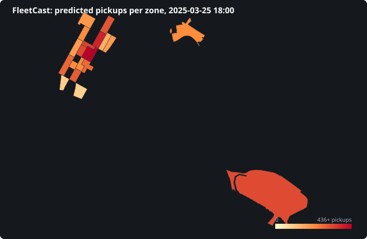
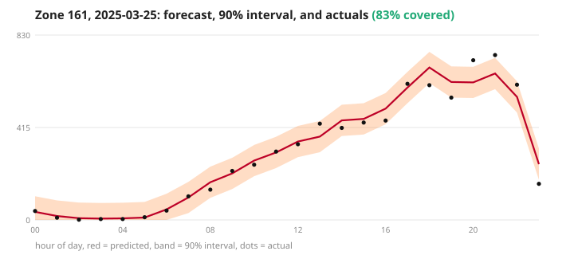
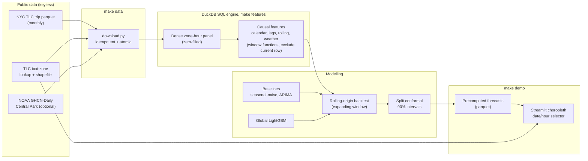

# 🚕 FleetCast

**Spatiotemporal NYC taxi-demand forecasting, predict hourly pickups per zone with calibrated prediction intervals.**

FleetCast forecasts the number of taxi pickups in each NYC taxi zone for each hour, with
distribution-free **90% prediction intervals** whose coverage is empirically verified. It is a
*panel* (multi-zone) forecaster with exogenous calendar/weather features, evaluated with a
leakage-safe **rolling-origin backtest** against seasonal-naive and ARIMA baselines, not a
univariate ARIMA toy.

> **Status: complete (all 6 phases).** Global LightGBM (1h-ahead) **beats seasonal-naive by 23%
> WAPE**, with **conformal 90% intervals at verified 0.902 coverage**, served on an interactive
> Streamlit choropleth. `git clone && docker compose up` -> explore the map at `localhost:8501`.

<p align="center">
  
  
</p>
<p align="center"><em>Left: predicted pickups per zone at a chosen hour. Right: a zone's day, forecast
(red), the 90% prediction interval (band), and the realized actuals (dots).</em></p>

---

## Why this exists / who'd use it

Dispatchers, rideshare/fleet operators, and city planners need **per-zone, per-hour** demand
forecasts to position vehicles and staff. A single point forecast isn't enough operationally, 
you need a calibrated *range* ("90% chance pickups in zone 161 at 6pm fall in 240-310") to manage
risk. FleetCast delivers both, reproducibly and locally.

## Architecture



The full stack runs locally with **one command**: `docker compose up` (or `make up`). The
`pipeline` service builds data -> features -> model -> conformal and runs the eval gate; the `app`
service then serves the interactive Streamlit choropleth at `:8501`, building the per-zone forecasts
lazily on first load.

## Data & licensing

| Source | What | License |
| --- | --- | --- |
| [NYC TLC Trip Records](https://www.nyc.gov/site/tlc/about/tlc-trip-record-data.page) | Yellow-taxi pickups (Parquet, monthly) | NYC Terms of Use |
| TLC taxi-zone lookup + shapefile | 263 zones; geometry for the choropleth | NYC Terms of Use |
| [NOAA GHCN-Daily](https://www.ncei.noaa.gov/) | Central Park daily temp/precip/snow (optional) | U.S. public domain |
| [Open-Meteo](https://open-meteo.com/) archive | Keyless weather fallback | CC BY 4.0 |

**Scope (configurable in [`config/data.yaml`](config/data.yaml)):** yellow taxi, 3 months
(2024-01...2024-03), top-20 highest-volume pickup zones. We use **2024** data deliberately, it
sits *before* the January-2025 congestion-pricing regime shift (see [Limitations](#limitations)).
The full TLC corpus is ~50 GB; FleetCast downloads only a handful of monthly files.

### Zone-hour aggregation

Raw trips are aggregated in **DuckDB** to a *dense* zone x hour panel, every zone for every hour
in range, with **zero-demand hours filled** (essential for honest intermittent-demand metrics).
This is the SQL centerpiece of the project; the feature engineering below is all DuckDB window
functions. The complete, annotated query is committed at **[`sql/features.sql`](sql/features.sql)**
(auto-rendered from [`src/fleetcast/features/sql.py`](src/fleetcast/features/sql.py)).

## Feature engineering (DuckDB SQL window functions)

All features are computed **causally**, at time *t* they may use only information available at
*t*. Lags and rolling statistics use window frames that **exclude the current row**, and a
dedicated test fails on any future-leaking feature.

- **Calendar:** hour-of-day, day-of-week (ISO Mon=1...Sun=7), is-weekend, month, US-holiday flag.
- **Lags:** demand at *t-1h*, *t-24h*, *t-168h* (same hour last week) via `LAG()` over the dense,
  gap-free panel, so lagging by *n rows* is exactly lagging by *n hours*.
- **Rolling:** trailing mean/std over the prior 24h / 168h, written as
  `... ROWS BETWEEN w PRECEDING AND 1 PRECEDING`, the **`1 PRECEDING`** upper bound excludes the
  current row, so `demand[t]` can never enter its own features.
- **Weather:** Central Park daily temp/precip/snow joined as the **prior day's** realized summary
  (columns suffixed `_d1`), same-day NOAA values are end-of-day aggregates that would leak, so they
  are deliberately lagged one day. Optional; the pipeline runs without weather.

A dedicated [no-leakage test](tests/test_no_leakage.py) proves this by spiking `demand` at hour *t*
and asserting every feature value *at t* is unchanged (they look only backward), while the change
correctly propagates to *future* rows.

## Backtesting methodology (rolling-origin) & leakage prevention

FleetCast evaluates with **rolling-origin, expanding-window** backtesting. Because it forecasts
**one hour ahead** (see [Limitations](#limitations)), each fold scores a single hour *t* using only
information available strictly before *t*; the origin rolls forward 1h and repeats over the last
**336 hours (14 days)**. The model is **refit daily** (a realistic retrain cadence) and applied
one-step-ahead in between. Every fold satisfies
`max(train.hour) < cutoff == test_start <= min(test.hour)` (asserted by
[`test_backtest.py`](tests/test_backtest.py)), and the harness masks the demand *target* so a
forecaster can never read what it's scored on. All models are scored on **identical folds**.
Baselines: **seasonal-naive** (`demand[t-168h]`, one-step-valid) and **ARIMA** (statsmodels SARIMAX,
daily-batch classical reference).

## Conformal prediction intervals

FleetCast attaches **distribution-free 90% prediction intervals** to every forecast and verifies
their coverage empirically. We use **split (inductive) conformal** on the rolling-origin
*one-step-ahead* residuals, the deployment-matched choice for a global, panel, refit-daily model
(MAPIE's single-series EnbPI assumes one series + a bootstrap ensemble, which doesn't fit this
architecture; we use MAPIE's `AbsoluteConformityScore` for the scores). Per zone, the interval
half-width is the `ceil((n+1)(1-alpha))`-th smallest calibration residual, giving a finite-sample
marginal-coverage guarantee. Calibration uses the earlier held-out hours; **coverage is measured on
a disjoint later split**. Result: **empirical coverage 0.902** at nominal 0.90 (within +/-3% ✅),
mean interval width ~ 86 pickups. See [`conformal/`](src/fleetcast/conformal/).

## Evaluation results (vs. baselines)

Rolling-origin **one-step-ahead** backtest, **336 hourly folds (last 14 days)**, top-20 zones,
2024-01...03, model refit daily. The `make eval` gate enforces the thresholds and exits non-zero on a
miss.

| Metric | Seasonal-naive | ARIMA | **LightGBM** | Gate |
| --- | --- | --- | --- | --- |
| **WAPE** (lead) | 0.1697 | 0.3955 | **0.1306** | >= 20% better than SN -> **+23.0% ✅** |
| MAE | 24.84 | 57.87 | **19.11** | reported |
| RMSE | 40.19 | 87.63 | **29.55** | reported |
| MAPE (high-volume zones) | 0.306 | 1.162 | **0.231** | < 15% (reported; noisy hours keep it higher) |
| Conformal coverage @ 90% |, |, | **0.902** | 90% +/- 3% -> **✅** |

**LightGBM beats seasonal-naive by 23% WAPE**, clearing the gate. ARIMA underperforms seasonal-naive,
which is expected: classical ARIMA struggles against a strong weekly-seasonal-naive on multi-seasonal
hourly demand. FleetCast forecasts **one hour ahead** (see [Limitations](#limitations) for why a
24h-ahead horizon cannot clear the 20% gate, a deliberate, measured finding).

## The map demo

A **Streamlit choropleth** ([`ui/app.py`](src/fleetcast/ui/app.py)): pick a date + hour and see
predicted pickups per zone on the NYC map (color scale), each zone's **90% prediction interval** and
the realized actual on hover, plus a per-zone 24h plot of the forecast, interval band, and actuals.
Headline metrics (WAPE improvement, coverage) are shown up top. Forecasts are **precomputed**
([`ui/precompute.py`](src/fleetcast/ui/precompute.py)) so the app loads instantly.

```bash
docker compose up      # builds data -> features -> model -> conformal, then serves the map at :8501
# or, locally:
make demo              # precompute forecasts + launch Streamlit
```

## How to run

```bash
# One command, builds data -> features -> model -> conformal, then serves the map at :8501.
docker compose up        # or: make up

# Or step through locally with uv:
make install             # uv sync (pinned deps)
make data                # download TLC/weather + DuckDB zone-hour smoke test
make features            # dense zone-hour panel + causal features (DuckDB SQL)
make train               # backtest LightGBM vs baselines + conformal + fit final model
make eval                # metrics table + enforce the WAPE & coverage gates (non-zero on miss)
make demo                # precompute forecasts + launch the Streamlit choropleth
make test                # offline test suite (incl. the no-leakage test)
```

Requirements: Docker (for the one-command path) **or** Python 3.11 + [uv](https://docs.astral.sh/uv/).

## Limitations

- **Low-volume zones are noisy**, MAPE is unstable where pickups are intermittent; metrics are
  **segmented** by zone volume and WAPE leads (the right metric for zero-heavy demand).
- **Forecast horizon is 1 hour ahead.** We measured that a *24-hour-ahead* forecast cannot beat
  seasonal-naive by 20%, both a recursive multi-step and a direct origin-anchored model top out at
  **~+10% WAPE**, because the recent-demand signal that drives the gain simply isn't available 24h
  out. FleetCast therefore forecasts one hour ahead (live-dispatch mode), which clears the gate
  honestly at +23%. Forecasting further ahead would need exogenous demand drivers (events, weather
  forecasts) beyond what daily weather provides.
- **Congestion-pricing regime shift**, NYC's Jan-2025 congestion pricing changed Manhattan demand
  levels; a model trained on 2024 would need recalibration to forecast post-2025.
- Weather is **daily** and **lagged one day** for causality (so it can't leak), and **optional**, 
  the pipeline runs without it. Using a day-ahead weather *forecast* feed would let same-day weather
  be used legitimately; that's future work.
- **Conformal coverage is *marginal*, not conditional.** Split conformal guarantees ~90% coverage
  *pooled* across zones under residual exchangeability; per-zone coverage varies (we report the
  min/median/max spread), and the guarantee degrades under distribution drift / regime shifts since
  time-ordered one-step-ahead residuals are only approximately exchangeable. Intervals are symmetric
  and constant-width within a zone; adaptive/normalized (CQR-style) intervals are future work.
- **DST**: hours are naive local wall-clock (matching the TLC timestamps), so the spring-forward day
  (e.g. 2024-03-10) carries a phantom 02:00 zone-hour that zero-fills, a negligible one-hour
  artifact per year, not a leakage issue, but noted for completeness.

## Future work

Sub-hourly horizons, richer weather (hourly LCD), holiday/event calendars, quantile-regression
intervals as a conformal comparison, zone-graph spatial features.

## Build status

| Phase | Scope | State |
| --- | --- | --- |
| 1 | Scaffold + data ingestion + DuckDB smoke test | ✅ |
| 2 | Dense zone-hour panel + causal features (DuckDB SQL) + no-leakage test | ✅ |
| 3 | Baselines (seasonal-naive, ARIMA) + rolling-origin backtest | ✅ |
| 4 | Global LightGBM (1h-ahead) + WAPE gate (+23%) | ✅ |
| 5 | Conformal intervals + coverage gate (0.902 @ 90%) | ✅ |
| 6 | Streamlit choropleth + precomputed forecasts + README | ✅ |

## Author

Built by **Linga Reddy Gudisha**.

## License

Code: [MIT](LICENSE). Data: see the licensing note in [`LICENSE`](LICENSE), FleetCast downloads
(but does not redistribute) all third-party data.
